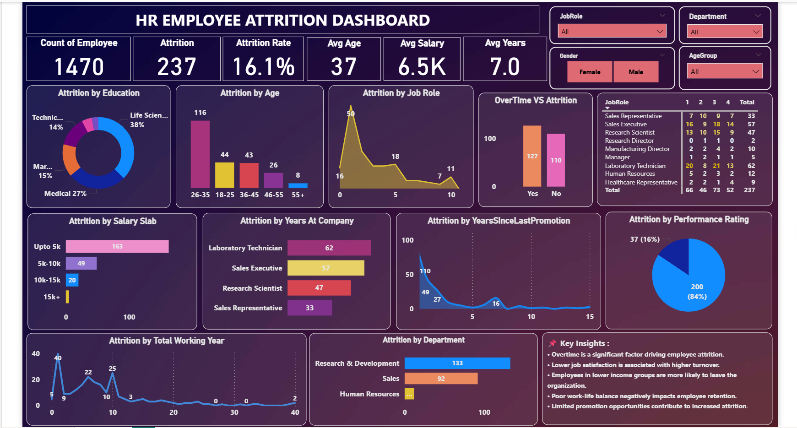

# SkillCraft Technology - Task 03

## Employee Attrition Analysis Dashboard

### Project Overview

This project focuses on analyzing employee attrition using Power BI. The dashboard provides interactive visualizations to identify the key factors influencing employee turnover and workforce retention.

### Objective

To build an interactive dashboard that answers the question:

**Why are employees leaving the organization?**

### Tools Used

* Power BI
* DAX
* Microsoft Excel / CSV Dataset

### Dashboard Features

* Attrition Rate Analysis
* Department-wise Attrition
* Age Group Analysis
* Job Satisfaction Analysis
* Work-Life Balance Analysis
* Overtime Impact on Attrition
* Salary and Income Analysis
* Interactive Slicers for Data Exploration

### Key Findings

* Employees working overtime show higher attrition rates.
* Low job satisfaction contributes to increased employee turnover.
* Lower-income employees are more likely to leave the organization.
* Poor work-life balance negatively affects employee retention.
* Limited promotion opportunities influence attrition.

### Outcome

The dashboard helps identify the major drivers of employee attrition and provides actionable insights to support employee retention strategies.

### Dashboard Preview

